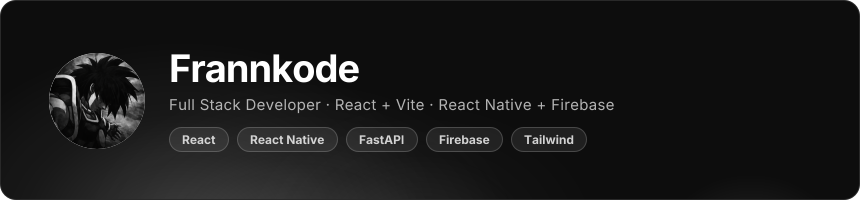
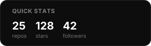
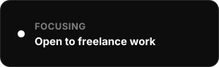
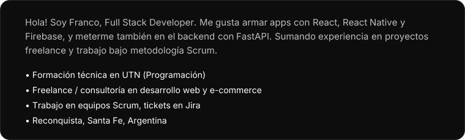
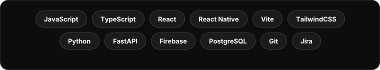
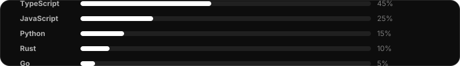

 

<table width="100%">
<tr>
<td width="63%" valign="top">

<b>Frannkode</b> · Full Stack Developer 
Reconquista, Santa Fe, Argentina

</td>
<td width="37%" valign="top">

 

</td>
</tr>
</table>

 

<h2 align="center">👨‍💻 <em>About me</em></h2>

 

<h2 align="center">⚙️ <em>Technologies</em></h2>

 

<h2 align="center">🧬 <em>Top Languages</em></h2>

<h2 align="center">🚀 <em>Featured Projects</em></h2>

  <a href="https://github.com/Frannkode/ViciosBurger"><b>ViciosBurger</b></a> · React Native app for food delivery 
  <a href="https://github.com/Frannkode/ViciosBurgerApp"><b>ViciosBurgerApp</b></a> · PWA version of the delivery app 
  <a href="https://github.com/Frannkode/ReactVicios"><b>ReactVicios</b></a> · Mobile-first menu with WhatsApp ordering 
  <a href="https://github.com/Frannkode/ElCruceRestaurant"><b>ElCruceRestaurant</b></a> · Restaurant site, React + Tailwind v4 
  <a href="https://github.com/Frannkode/Innovare"><b>Innovare</b></a> · Web app built with Create React App 
  <a href="https://github.com/Frannkode/Portfolio-Web"><b>Portfolio-Web</b></a> · My personal portfolio, React 19 + Framer Motion 
  <a href="https://github.com/Frannkode/ATARAXIA"><b>ATARAXIA</b></a> · TypeScript project 
  <a href="https://github.com/Frannkode/QuickOrder"><b>QuickOrder</b></a> · TypeScript ordering system 
  <a href="https://github.com/Frannkode/FullBebidas"><b>FullBebidas</b></a> · E-commerce site for beverages 
  <a href="https://github.com/Frannkode/Indumentaria"><b>Indumentaria</b></a> · E-commerce site for clothing 
  <a href="https://github.com/Frannkode/MotoPartes"><b>MotoPartes</b></a> · E-commerce site for motorcycle parts 
  <a href="https://github.com/Frannkode/Parras"><b>Parras</b></a> · JavaScript project

 

<h2 align="center">📊 <em>Statistics</em></h2>

  

